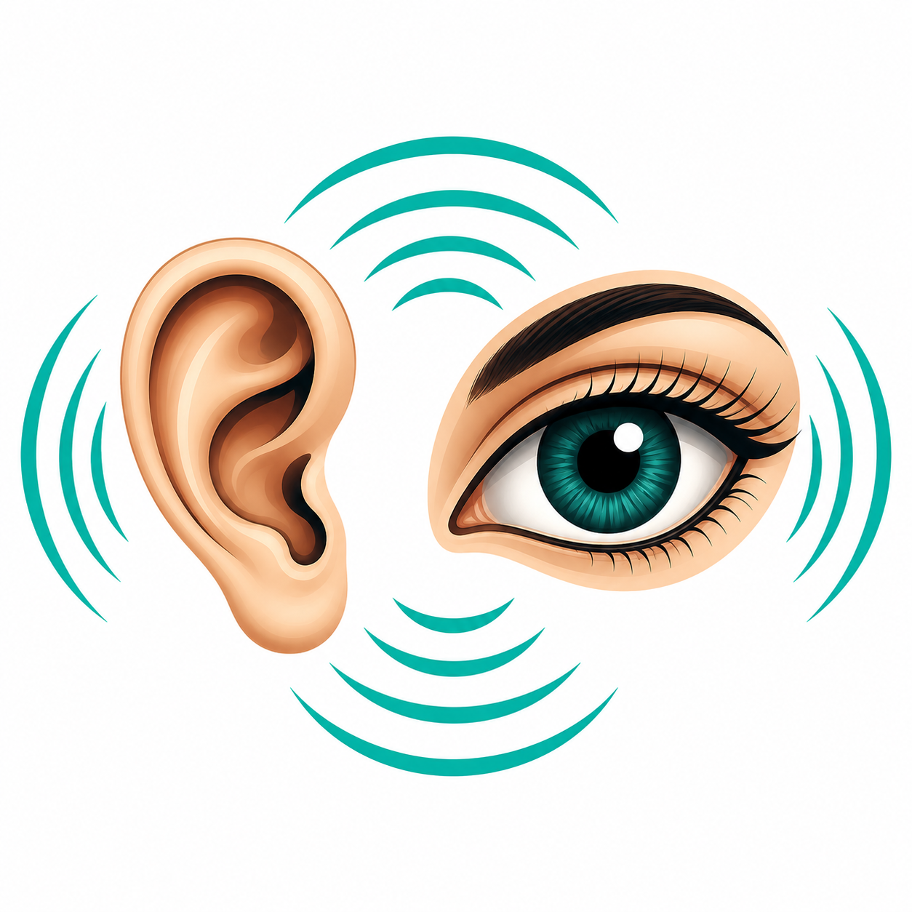

# 👁️ Aural Sight

<p align="center">
  
</p>

<h3 align="center">
  An AI-Powered Assistive Mobile Application for Visually Impaired Users
</h3>

<p align="center">
  <b>See the world. Hear the world. Experience independence.</b>
</p>

<p align="center">
  
  
  
  
  
</p>

---

## 🌟 About the Project

**Aural Sight** is an AI-powered assistive mobile application developed as a **Final Year Project** to improve accessibility and independence for visually impaired users.

The application combines **Computer Vision, Optical Character Recognition (OCR), Speech Recognition, Wake Word Detection, and Hand Gesture Recognition** into a single mobile platform.

Aural Sight is designed with an **offline-first approach**, allowing major AI-powered accessibility features to operate directly on the user's device without requiring a continuous internet connection.

---

## 🎯 Project Vision

The vision behind Aural Sight is simple:

> **Use Artificial Intelligence to help visually impaired individuals better understand and interact with their surroundings.**

Instead of relying on multiple applications or external assistance, Aural Sight brings several accessibility technologies together into one voice-controlled assistant.

---

# ✨ Key Features

## 🎯 1. Object Detection

Aural Sight uses **SSD MobileNet** with the **COCO Dataset** to detect objects in real time through the device camera.

The system can identify common objects such as:

- 👤 People
- 🪑 Chairs
- 🍾 Bottles
- 🚪 Doors
- 📱 Electronic devices
- 👜 Bags
- 🐕 Animals
- 📦 Everyday objects

Detected objects can be communicated to the user through audio feedback.

---

## 📖 2. OCR Reading Mode

The OCR module allows users to point their camera toward printed text and have it converted into speech.

Useful for reading:

- 📚 Books
- 🏷️ Product labels
- 💊 Medicine boxes
- 🍽️ Menus
- 📄 Documents
- 🪧 Signs
- 📝 Printed notes

The application uses **Google ML Kit OCR** for text recognition.

---

## ✋ 3. Gesture Recognition

Aural Sight provides touch-free interaction using **hand gesture recognition** powered by **MediaPipe**.

This allows users to interact with the application without relying entirely on touch-based controls.

---

## 🎙️ 4. Voice-Controlled Assistant

The application is designed around hands-free interaction.

Users can control important features using voice commands instead of navigating through conventional touch interfaces.

### Supported Commands

```text
Object Detection
OCR Mode
Gesture Mode
Go Back
Open Settings
Change Theme
Font Bigger
Font Smaller

🧠 5. Custom Wake Word

Aural Sight includes a custom-trained lightweight AI model for wake-word detection.

The assistant continuously listens for:

🗣️ "Hey Luna"

Once the wake word is detected, the application enters command mode and waits for the user's instruction.

This provides a more natural assistant-like experience.

🔒 6. Offline & Privacy-Focused

One of the major goals of Aural Sight is to minimize dependency on cloud services.

Core functionality is designed to run locally on the device whenever possible.

Benefits
🔐 Improved privacy
⚡ Faster response
🌐 Reduced internet dependency
📱 On-device AI processing
♿ Better accessibility in different environments
💾 7. Local Data Storage

Aural Sight uses Hive Database for lightweight local storage.

It can be used for storing application settings and other locally required information.

🧩 System Architecture

The application combines multiple AI technologies into one accessibility platform.
                    ┌─────────────────────┐
                    │     Aural Sight     │
                    │    Mobile App       │
                    └──────────┬──────────┘
                               │
              ┌────────────────┼────────────────┐
              │                │                │
              ▼                ▼                ▼
        🎙️ Voice Input    📷 Camera Input   ✋ Gestures
              │                │                │
              ▼                ▼                ▼
        Wake Word        Object Detection   MediaPipe
        Detection        SSD MobileNet
              │                │
              │                ▼
              │          Object Recognition
              │
              ▼
        Voice Commands
              │
       ┌──────┼────────┐
       │      │        │
       ▼      ▼        ▼
     OCR    Objects   Settings
       │      │        │
       └──────┼────────┘
              ▼
        🔊 Audio Feedback
              │
              ▼
        👤 End User

🛠️ Technologies Used
Technology	Purpose
Flutter	Mobile application development
Dart	Application programming
TensorFlow Lite	On-device AI inference
SSD MobileNet	Real-time object detection
COCO Dataset	Object detection training/detection classes
Google ML Kit	OCR / text recognition
MediaPipe	Hand gesture recognition
Hive	Local database/storage
Python	AI model development
Google Colab	Model training and experimentation
Custom CNN Models	Wake-word/audio classification
📁 Project Structure
aural_sight/
│
├── android/
├── ios/
│
├── lib/
│   ├── models/
│   ├── providers/
│   ├── screens/
│   ├── services/
│   ├── theme/
│   ├── utils/
│   └── widgets/
│
├── assets/
│   ├── images/
│   │   └── mapplogo4.png
│   ├── model/
│   ├── models/
│   ├── tessdata/
│   └── vosk-model/
│
├── windows/
├── linux/
├── macos/
├── web/
│
├── test/
│
├── pubspec.yaml
└── README.md
🚀 Getting Started
Prerequisites

Before running Aural Sight, make sure you have:

Flutter SDK
Dart SDK
Android Studio
Android SDK
A physical Android device or emulator
Required Flutter dependencies
📥 Installation
1. Clone the Repository
git clone https://github.com/your-username/aural_sight.git
2. Open the Project
cd aural_sight
3. Install Dependencies
flutter pub get
4. Connect a Device

Connect an Android device or start an emulator.

Check available devices:

flutter devices
5. Run the Application
flutter run
🧪 AI & Machine Learning Components

Aural Sight integrates several machine learning components:

Computer Vision

SSD MobileNet provides lightweight real-time object detection suitable for mobile devices.

Optical Character Recognition

Google ML Kit processes camera input and extracts readable text.

Gesture Recognition

MediaPipe detects and tracks hand landmarks to recognize user gestures.

Wake Word Detection

A custom lightweight audio classification model is used to detect the wake phrase:

"Hey Luna"

The goal is to provide fast and efficient local wake-word detection.

♿ Accessibility Focus

Aural Sight is designed with accessibility as a primary consideration.

The application focuses on:

🎙️ Voice-first interaction
🔊 Audio feedback
👁️ Reduced dependency on visual interfaces
✋ Touch-free interaction
🔠 Adjustable font sizes
🎨 Theme customization
📱 Simple navigation
🔒 Privacy-focused local processing
🔐 Privacy

Aural Sight follows an offline-first philosophy for its core AI features.

Whenever possible, processing is performed directly on the user's device rather than sending sensitive camera, audio, or text data to external servers.

This approach helps improve:

User privacy
Response time
Reliability
Accessibility without constant connectivity
🎓 Final Year Project

Project Title:

Aural Sight – An AI-Powered Assistive Mobile Application for Visually Impaired Users

This project demonstrates the integration of:

Artificial Intelligence + Computer Vision + Speech Recognition + OCR + Gesture Recognition + Mobile Application Development

into a unified accessibility solution.

👨‍💻 Development Team
Made By

Ghani Abdul Reman Khan
Sardar Hasnain Hamid
Mahnoor Kalsoom

Supervisor

Dr. Rabnawaz Jadoon

💡 Future Enhancements

Potential future improvements include:

🧭 AI-powered navigation assistance
🚦 Traffic signal and road-sign recognition
💰 Currency recognition
👤 Face recognition with privacy controls
🧍 Person identification
📍 GPS-based navigation
🆘 Emergency assistance
📞 Voice-based emergency calling
🧠 More advanced contextual AI assistance
🌐 Multilingual voice support
📱 Improved wearable-device integration
❤️ Our Goal

Aural Sight is more than a software project.

It is an attempt to use modern technology to create a more accessible, independent, and inclusive world for visually impaired individuals.
